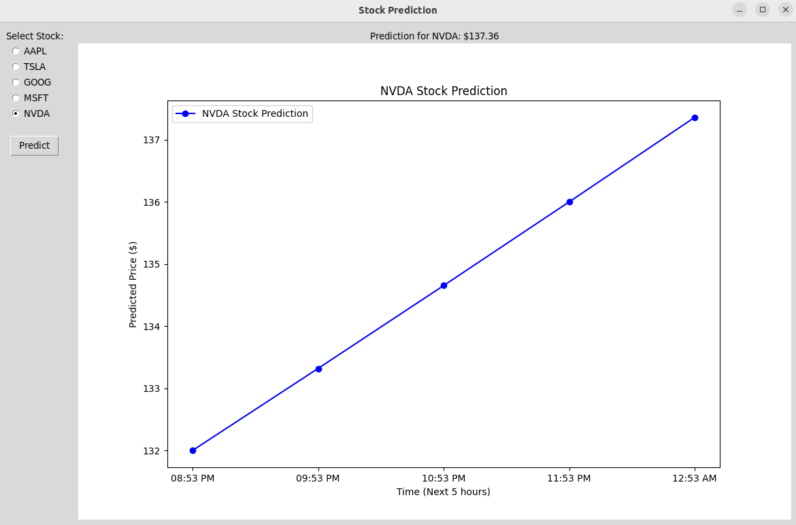
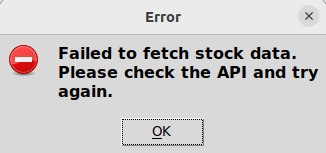

# PredictX - Stock Prediction Application

## Features
- Fetch real-time stock data from Polygon.io
- Predict stock prices for the next 24 hours
- Display predictions in a graphical interface


## Install dependencies

   ```bash
   pip install -r requirements.txt
   ```

## Run

   ```bash
    python3 main.py
    ```


# Output

### When NVDA is selected



### When API fails to fetch the data




